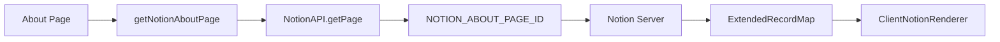
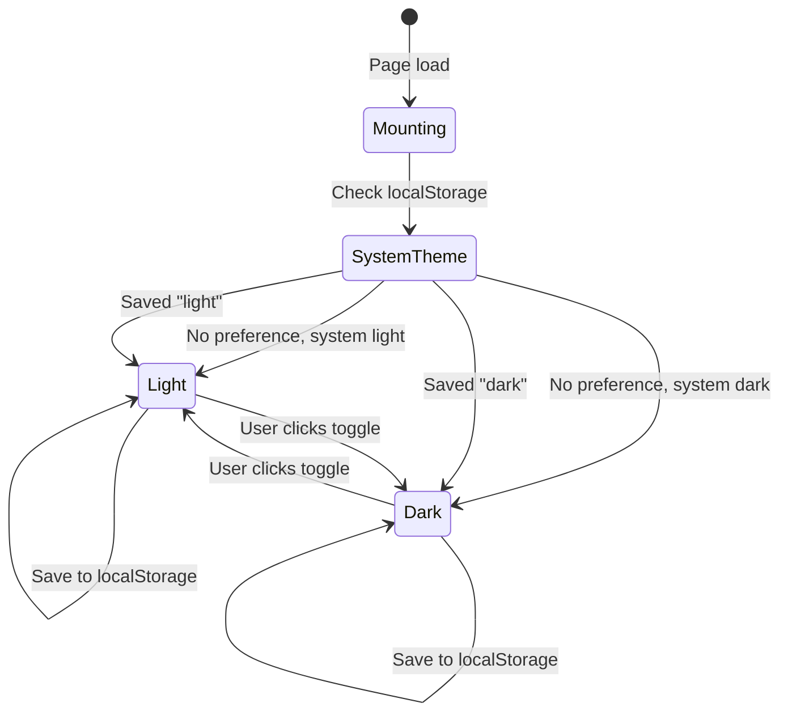
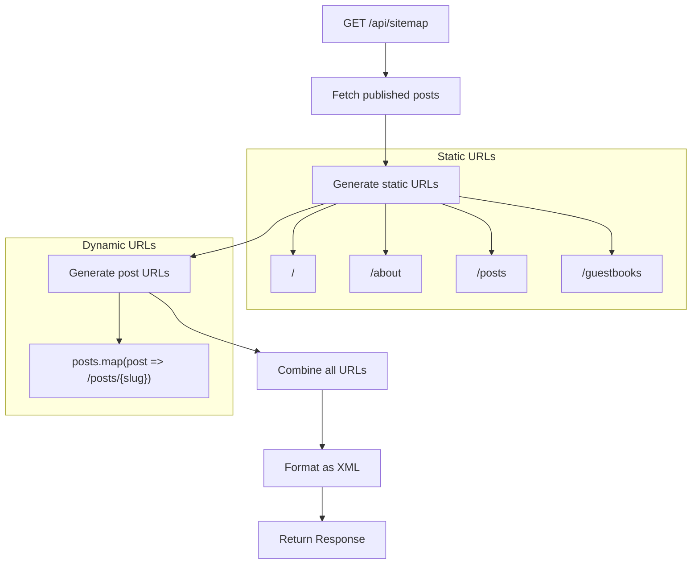
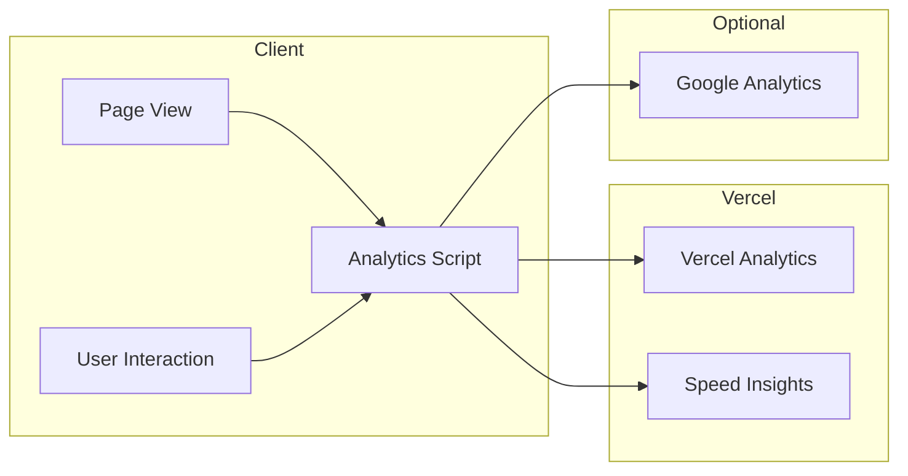

# Site Domain Information Architecture

This document describes the information architecture for Site domain components, which affect multiple pages across the blog.

## Global Components

### Header Navigation

**Location**: All pages

**Structure**:
```
┌─────────────────────────────────────────────────────────────┐
│  [Logo]     Home  |  Posts  |  About  |  Guestbook    [🌙]  │
└─────────────────────────────────────────────────────────────┘
```

**Elements**:
| Element | Function | Target |
|---------|----------|--------|
| Logo | Brand identity, home link | `/` |
| Home | Navigation | `/` |
| Posts | Navigation | `/posts` |
| About | Navigation | `/about` |
| Guestbook | Navigation | `/guestbooks` |
| Theme Toggle | Switch light/dark | Client-side |

---

### Footer

**Location**: All pages

**Structure**:
```
┌─────────────────────────────────────────────────────────────┐
│                                                             │
│         © 2024 Meti. Built with Next.js & Notion           │
│                                                             │
└─────────────────────────────────────────────────────────────┘
```

---

## Screen: Home Page (`/`)

### Overview

The home page introduces the blog owner and showcases featured content.

### Layout

```
┌─────────────────────────────────────────────────────────────┐
│                        Header                               │
├─────────────────────────────────────────────────────────────┤
│                                                             │
│                     ┌─────────┐                             │
│                     │ Mascot  │                             │
│                     │  Image  │                             │
│                     └─────────┘                             │
│                                                             │
│              안녕하세요. 메티입니다.                          │
│                                                             │
│     노션에서 작성한 TIL을 쉽게 공개하기 위해 만든              │
│               블로그 입니다!                                 │
│                                                             │
│                  [GitHub Button]                            │
│                                                             │
├─────────────────────────────────────────────────────────────┤
│                    Featured Posts                           │
│  ┌──────────┐  ┌──────────┐  ┌──────────┐  ┌──────────┐    │
│  │ Post 1   │  │ Post 2   │  │ Post 3   │  │ Post 4   │    │
│  │ Card     │  │ Card     │  │ Card     │  │ Card     │    │
│  └──────────┘  └──────────┘  └──────────┘  └──────────┘    │
├─────────────────────────────────────────────────────────────┤
│                        Footer                               │
└─────────────────────────────────────────────────────────────┘
```

### Components

| Component | Location | Data Source |
|-----------|----------|-------------|
| Hero | Center top | Static content |
| Mascot Image | Hero section | `/mascot.png` |
| GitHub Button | Hero section | Static link |
| Featured Posts | Below hero | `getNotionPosts()` |

### Responsive Behavior

| Breakpoint | Layout |
|------------|--------|
| Mobile (< 768px) | Single column, stacked posts |
| Tablet (768-1024px) | 2-column post grid |
| Desktop (> 1024px) | 4-column post grid |

---

## Screen: About Page (`/about`)

### Overview

Detailed information about the blog owner rendered from Notion.

### Layout

```
┌─────────────────────────────────────────────────────────────┐
│                        Header                               │
├─────────────────────────────────────────────────────────────┤
│                                                             │
│                     About Me                                │
│                                                             │
│  ┌─────────────────────────────────────────────────────┐   │
│  │                                                     │   │
│  │               Notion Page Content                   │   │
│  │                                                     │   │
│  │   - Rich text formatting                           │   │
│  │   - Images and media                               │   │
│  │   - Code blocks                                    │   │
│  │   - Lists and tables                               │   │
│  │                                                     │   │
│  └─────────────────────────────────────────────────────┘   │
│                                                             │
├─────────────────────────────────────────────────────────────┤
│                        Footer                               │
└─────────────────────────────────────────────────────────────┘
```

### Components

| Component | Location | Data Source |
|-----------|----------|-------------|
| Page Title | Top | Static |
| Notion Renderer | Main content | `getNotionAboutPage()` |

### Data Flow



---

## Component: Theme Toggle

### States



### Visual States

| State | Icon | Background | Text |
|-------|------|------------|------|
| Light | 🌙 (Moon) | White/Light gray | Dark gray/Black |
| Dark | ☀️ (Sun) | Dark gray/Black | White/Light gray |
| Mounting | Loading dot | Current theme | - |

### Implementation

```typescript
// ThemeToggle component logic
export function ThemeToggle() {
  const [mounted, setMounted] = useState(false);
  const { theme, setTheme } = useTheme();

  useEffect(() => setMounted(true), []);

  // Show loading state until hydrated
  if (!mounted) return <LoadingDot />;

  return theme === "light" ? (
    <DarkModeIcon onClick={() => setTheme("dark")} />
  ) : (
    <LightModeIcon onClick={() => setTheme("light")} />
  );
}
```

---

## Component: Hero Section

### Layout Details

```
                    ┌──────────────────┐
                    │    ┌────────┐    │
                    │    │        │    │
                    │    │ 240px  │    │
                    │    │        │    │
                    │    └────────┘    │
                    │                  │
                    │  안녕하세요.      │
                    │   메티입니다.     │
                    │                  │
                    │  [Description]   │
                    │                  │
                    │  ┌────────────┐  │
                    │  │  GitHub   │  │
                    │  │  Button   │  │
                    │  └────────────┘  │
                    └──────────────────┘
```

### Elements

| Element | Style | Content |
|---------|-------|---------|
| Image | 240x240, centered | `/mascot.png` |
| Greeting | Bold, 3xl | "안녕하세요. 메티입니다." |
| Description | Normal, default | Blog purpose |
| Button | Blue bg, rounded | "Github" with icon |

---

## Sitemap Structure

### URL Hierarchy

```
/                           # Home page
├── /posts                  # Posts list
│   ├── /posts/[slug-1]    # Individual posts
│   ├── /posts/[slug-2]
│   └── ...
├── /about                  # About page
└── /guestbooks            # Guestbook page
```

### Sitemap Generation Flow



### Priority Assignment

| Page Type | Priority | Change Frequency |
|-----------|----------|------------------|
| Home | 1.0 | daily |
| About | 0.8 | daily |
| Posts List | 0.8 | daily |
| Guestbook | 0.8 | always |
| Individual Post | 0.8 | daily |

---

## Analytics Integration

### Data Flow



### Implementation Location

```typescript
// src/app/layout.tsx
import { Analytics } from "@vercel/analytics/react";
import { SpeedInsights } from "@vercel/speed-insights/next";

export default function RootLayout({ children }) {
  return (
    <html>
      <body>
        {children}
        <Analytics />
        <SpeedInsights />
      </body>
    </html>
  );
}
```

---

## SEO Metadata Structure

### Page-Level Metadata

```typescript
// Example for Posts page
export const metadata: Metadata = {
  title: "Posts - Meti's Blog",
  description: "Browse all technical blog posts",
  openGraph: {
    title: "Posts - Meti's Blog",
    description: "Browse all technical blog posts",
    type: "website",
  },
};
```

### Dynamic Metadata (Post Detail)

```typescript
// src/app/posts/[slug]/page.tsx
export async function generateMetadata({ params }): Promise<Metadata> {
  const post = await getPost(params.slug);

  return {
    title: `${post.title} - Meti's Blog`,
    description: post.aiSummary || post.excerpt,
    openGraph: {
      title: post.title,
      description: post.aiSummary || post.excerpt,
      type: "article",
      images: [post.cover],
    },
  };
}
```

---

## Accessibility Considerations

### Keyboard Navigation

| Element | Key | Action |
|---------|-----|--------|
| Theme Toggle | Enter/Space | Toggle theme |
| Navigation Links | Tab | Focus next link |
| GitHub Button | Enter | Open repository |

### ARIA Labels

| Element | aria-label |
|---------|------------|
| Theme Toggle | "Toggle dark mode" |
| Navigation | "Main navigation" |
| Footer | "Site footer" |

### Color Contrast

| Theme | Foreground | Background | Contrast Ratio |
|-------|------------|------------|----------------|
| Light | #1a1a1a | #ffffff | 21:1 |
| Dark | #ffffff | #1a1a1a | 21:1 |
