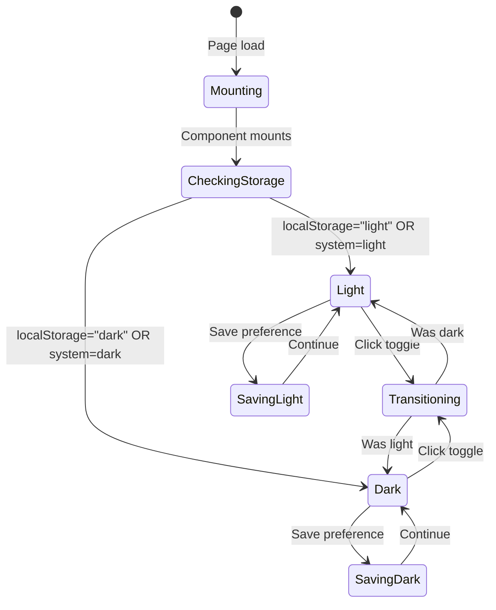
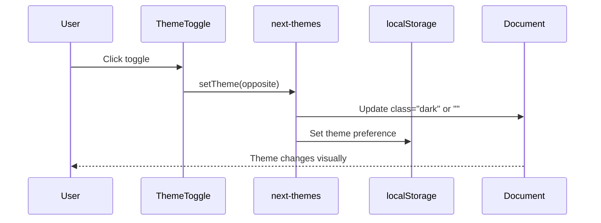
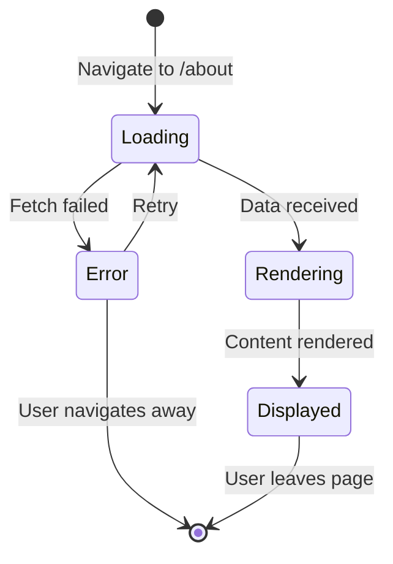
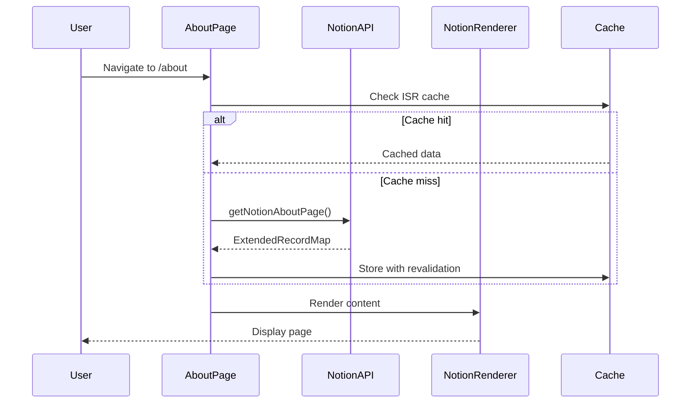
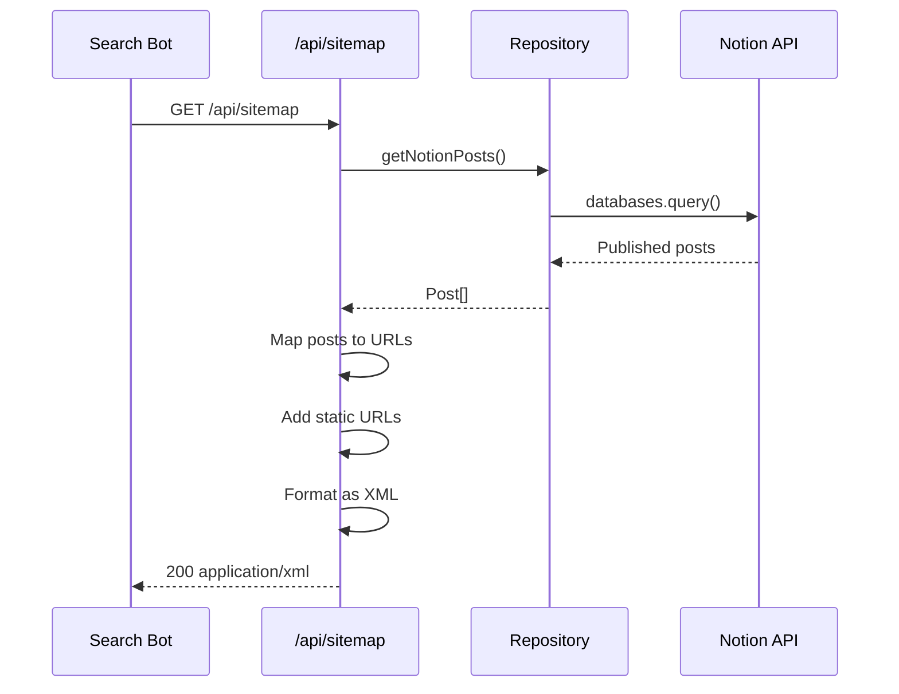
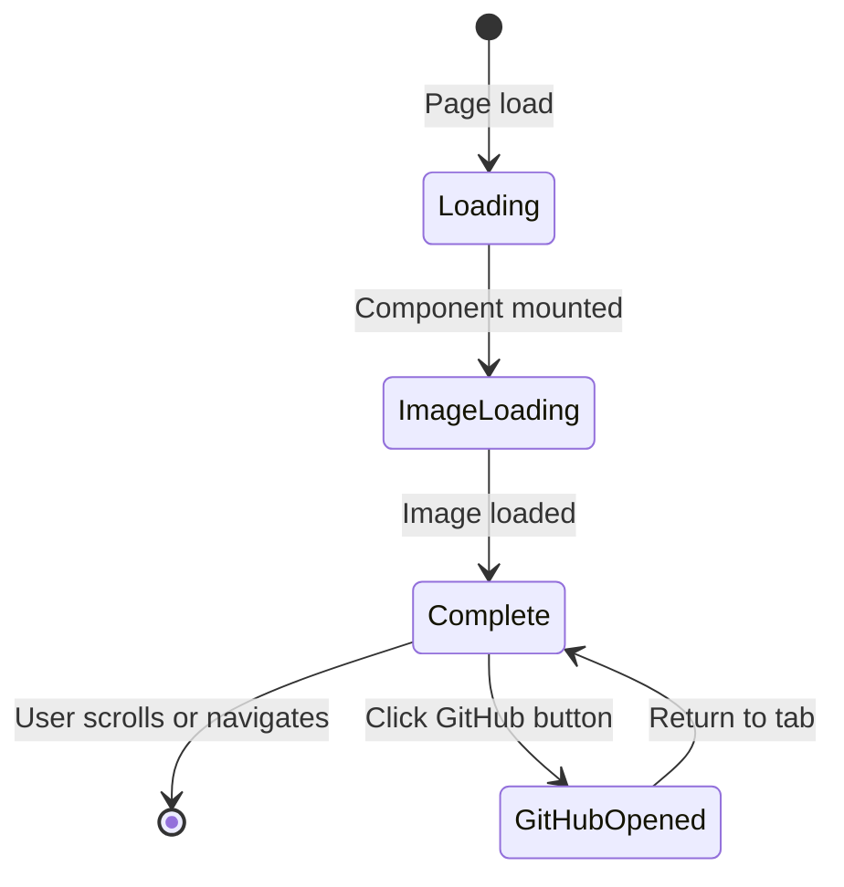

# Site Domain Use Cases (Frontend)

This document describes the frontend use cases for the Site domain, covering theme management, about page viewing, and SEO-related functionality.

## UC-F-030: Toggle Theme

### Overview

| Property | Value |
|----------|-------|
| Primary Actor | Visitor |
| Trigger | User clicks theme toggle icon |
| Precondition | Page is loaded and hydrated |
| Postcondition | Theme changed and persisted |

### Main Flow

1. **User** locates theme toggle in header
2. **System** displays current theme icon (sun/moon)
3. **User** clicks the toggle icon
4. **System** identifies current theme
5. **System** switches to opposite theme
6. **System** applies theme class to document
7. **System** saves preference to localStorage
8. **User** sees updated theme across all elements

### Alternative Flows

**AF-1: First Visit (No Saved Preference)**
1. At step 4, no preference in localStorage
2. System uses system theme preference
3. Continue from step 5 with detected theme

**AF-2: Page Not Hydrated**
1. At step 1, page still server-rendering
2. System shows loading indicator
3. Once hydrated, show correct toggle icon
4. User can then interact

**AF-3: localStorage Unavailable**
1. At step 7, localStorage throws error
2. System logs error silently
3. Theme applied for current session only
4. Preference lost on page refresh

### UI State Diagram



### Component Interaction



### State Management

```typescript
// ThemeToggle component
const [mounted, setMounted] = useState(false);
const { theme, setTheme } = useTheme();

useEffect(() => setMounted(true), []);

const toggleTheme = () => {
  setTheme(theme === "light" ? "dark" : "light");
};
```

---

## UC-F-031: View About Page

### Overview

| Property | Value |
|----------|-------|
| Primary Actor | Visitor |
| Trigger | User navigates to /about |
| Precondition | Blog is accessible |
| Postcondition | About content displayed |

### Main Flow

1. **User** clicks "About" in navigation
2. **System** routes to `/about` page
3. **System** fetches Notion page content (server-side)
4. **System** renders page with loading state
5. **System** receives Notion data
6. **System** passes data to NotionRenderer
7. **NotionRenderer** displays rich content
8. **User** reads about page content

### Alternative Flows

**AF-1: Cached Content**
1. At step 3, ISR cache has valid data
2. System returns cached Notion content immediately
3. Skip to step 6

**AF-2: Notion API Error**
1. At step 5, Notion API fails
2. System displays error message
3. User can retry or navigate away

**AF-3: Content Not Found**
1. At step 5, page ID returns empty
2. System displays "Content unavailable" message
3. User redirected to home

### UI State Diagram



### Component Interaction



### Data Flow

```typescript
// About page (Server Component)
export default async function AboutPage() {
  const aboutPage = await getNotionAboutPage();

  return (
    <main>
      <ClientNotionRenderer recordMap={aboutPage} />
    </main>
  );
}
```

---

## UC-F-032: Generate Sitemap

### Overview

| Property | Value |
|----------|-------|
| Primary Actor | Search Engine Bot |
| Trigger | Bot requests /api/sitemap |
| Precondition | Blog is deployed |
| Postcondition | Valid XML sitemap returned |

### Main Flow

1. **Bot** requests `/api/sitemap`
2. **System** handles GET request
3. **System** fetches all published posts
4. **System** generates static page entries
5. **System** generates post entries with slugs
6. **System** combines all entries
7. **System** formats as XML
8. **System** returns sitemap with correct headers
9. **Bot** receives and parses sitemap

### Alternative Flows

**AF-1: No Published Posts**
1. At step 3, no posts returned
2. System generates only static pages
3. Continue from step 6

**AF-2: Notion API Error**
1. At step 3, post fetch fails
2. System returns 500 error
3. Bot will retry later

### Sitemap Generation Flow



### URL Generation

```typescript
// Sitemap API route
export async function GET() {
  const baseUrl = process.env.BLOG_URL || "";
  const posts = (await getNotionPosts()).map(Post.create);

  // Dynamic post URLs
  const postUrls = posts.map(({ slugifiedTitle, lastEditedTime }) => ({
    url: `${baseUrl}/posts/${slugifiedTitle}`,
    lastModified: new Date(lastEditedTime),
    changeFrequency: "daily",
    priority: 0.8,
  }));

  // Static URLs
  const staticUrls = [
    { url: baseUrl, priority: 1, changeFrequency: "daily" },
    { url: `${baseUrl}/about`, priority: 0.8, changeFrequency: "daily" },
    { url: `${baseUrl}/posts`, priority: 0.8, changeFrequency: "daily" },
    { url: `${baseUrl}/guestbooks`, priority: 0.8, changeFrequency: "always" },
  ];

  // Combine and format
  const sitemap = formatAsXml([...staticUrls, ...postUrls]);
  return new Response(sitemap, {
    headers: { "Content-Type": "application/xml" },
  });
}
```

---

## UC-F-033: View Hero Section

### Overview

| Property | Value |
|----------|-------|
| Primary Actor | Visitor |
| Trigger | User lands on home page |
| Precondition | Home page accessible |
| Postcondition | Hero section displayed |

### Main Flow

1. **User** navigates to home page
2. **System** renders Hero component
3. **System** loads mascot image
4. **System** displays greeting text
5. **System** shows blog description
6. **System** renders GitHub button
7. **User** sees complete hero section
8. **User** optionally clicks GitHub button
9. **System** opens repository in new tab

### UI State Diagram



### Component Structure

```typescript
export function Hero() {
  return (
    <section className="flex flex-col items-center gap-3 text-center">
      <Image
        src="/mascot.png"
        alt="profile_image"
        width={240}
        height={240}
        priority  // Load immediately (LCP optimization)
      />
      <h2 className="mt-4 font-bold text-3xl">
        안녕하세요. 메티입니다.
      </h2>
      <p>노션에서 작성한 TIL을 쉽게 공개하기 위해 만든 블로그 입니다!</p>
      <p>블로그의 소스코드는 아래 버튼을 통해 확인해주세요.</p>
      <Tooltip>
        <TooltipTrigger>
          <Link href="https://github.com/ywj3493/metis-blog">
            <button className="...">
              Github <AiFillGithub />
            </button>
          </Link>
        </TooltipTrigger>
        <TooltipContent>
          <p>블로그 repository 주소</p>
        </TooltipContent>
      </Tooltip>
    </section>
  );
}
```

---

## Error Handling Summary

| Use Case | Error Type | User Message | Recovery Action |
|----------|-----------|--------------|-----------------|
| UC-F-030 | localStorage unavailable | (silent) | Session-only theme |
| UC-F-031 | Notion API error | "콘텐츠를 불러올 수 없습니다" | Retry button |
| UC-F-032 | Post fetch error | 500 response | Bot retries |
| UC-F-033 | Image load error | Alt text displayed | Browser refresh |

---

## Accessibility Considerations

| Use Case | Accessibility Feature |
|----------|----------------------|
| UC-F-030 | Keyboard operable (Enter/Space), focus visible |
| UC-F-031 | Semantic headings, alt text for images |
| UC-F-032 | N/A (machine consumption) |
| UC-F-033 | Image alt text, tooltip for button |

---

## Performance Considerations

| Aspect | Optimization |
|--------|-------------|
| Theme Switch | CSS transitions, no layout shift |
| About Page | ISR caching, streaming |
| Sitemap | Edge function, cached posts |
| Hero Image | Priority loading, optimized format |
