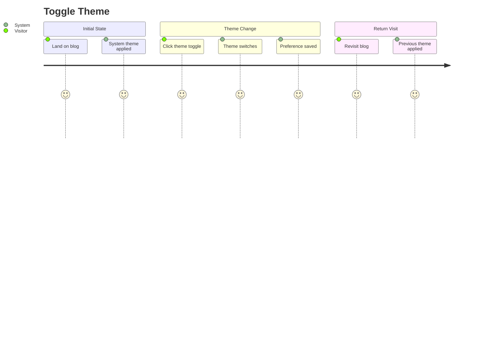
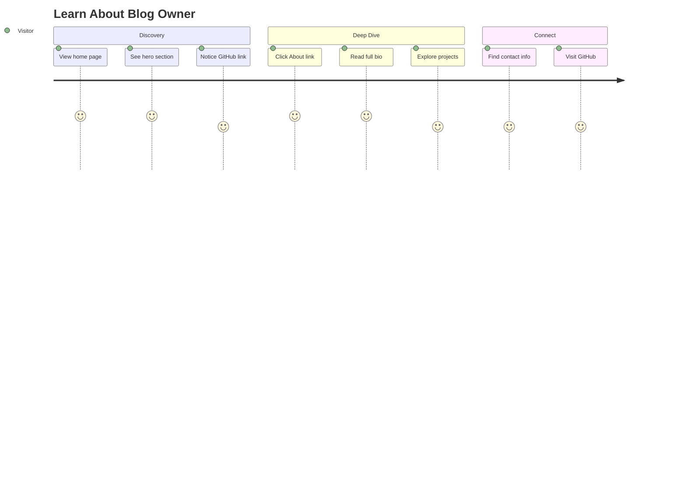
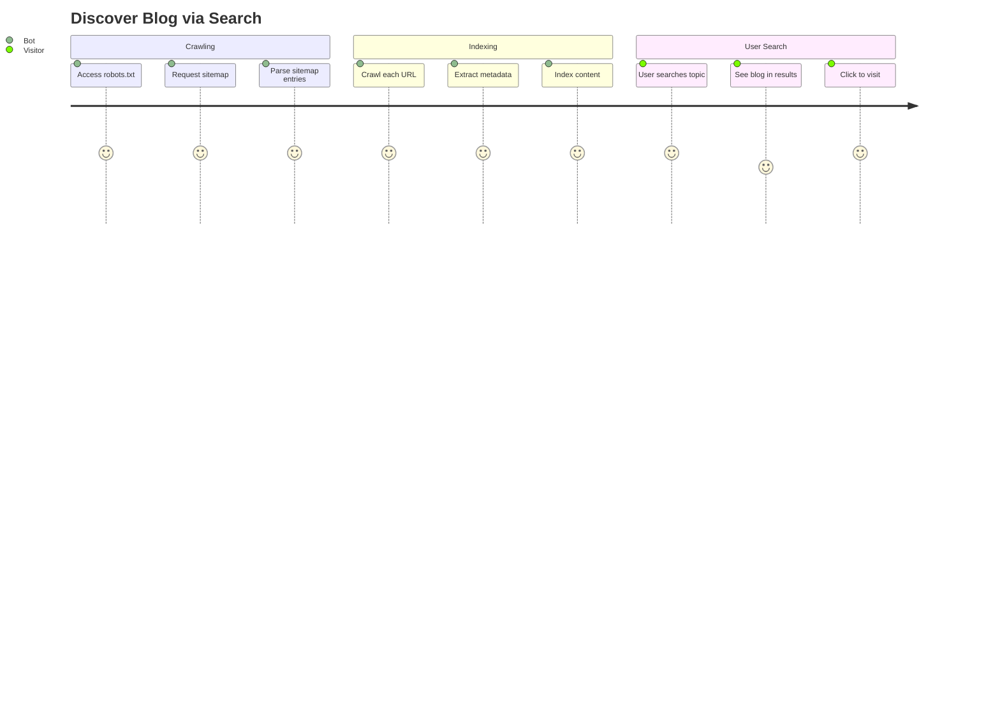
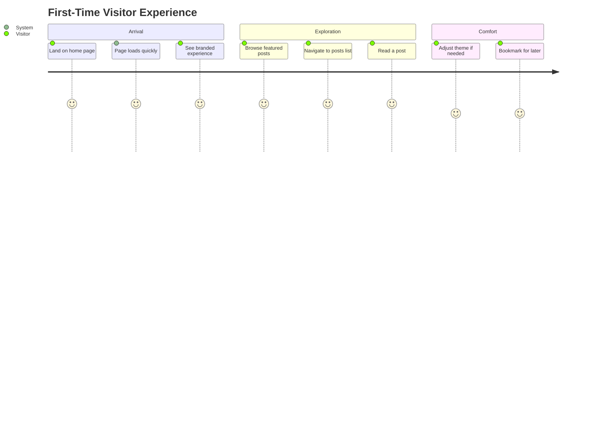

# Site Domain User Stories

This document describes end-to-end user journeys for the Site domain, covering theme preferences, discovering the blog owner, and search engine optimization.

## User Personas

### Visitor
Anonymous blog reader who wants a comfortable reading experience and easy access to information about the blog owner.

### Blog Owner (Meti)
Content creator who wants the blog to be discoverable, performant, and representative of their personal brand.

### Search Engine Bot
Automated crawler that indexes content for search results.

---

## User Journeys

### Journey 1: Toggle Theme

**Persona**: Visitor
**Goal**: Switch between light and dark themes for comfortable reading
**Preconditions**: User has navigated to any page on the blog



#### Steps

1. **Initial Visit**
   - User action: Navigate to blog URL
   - System response: Detect system theme preference
   - Validation: Theme matches OS setting

2. **Locate Theme Toggle**
   - User action: Look for theme control in header
   - System response: Display sun/moon icon based on current theme
   - Validation: Toggle is visible and accessible

3. **Toggle Theme**
   - User action: Click theme toggle icon
   - System response:
     - Smoothly transition all colors
     - Update icon to reflect new theme
     - Save preference to localStorage
   - Validation: All UI elements update consistently

4. **Verify Change**
   - User action: Scroll through page
   - System response: All content respects new theme
   - Validation: No elements stuck in wrong theme

5. **Return Visit**
   - User action: Close and reopen browser, visit blog
   - System response: Apply saved theme preference
   - Validation: Theme persists across sessions

#### Success Criteria
- [ ] Theme toggle is accessible by keyboard
- [ ] No flash of wrong theme on page load
- [ ] All components support both themes
- [ ] Theme preference persists

#### Error Scenarios

| Scenario | User Experience | Recovery |
|----------|----------------|----------|
| localStorage unavailable | Uses system theme | None needed |
| JavaScript disabled | Light theme default | Static styling |
| Theme not persisting | Reverts to system | Clear browser data |

---

### Journey 2: Learn About Blog Owner

**Persona**: Visitor
**Goal**: Understand who created the blog and their background
**Preconditions**: User found the blog and wants more context



#### Steps

1. **View Hero Section**
   - User action: Arrive on home page
   - System response: Display mascot, greeting, blog description
   - Validation: Hero section prominently visible

2. **Read Introduction**
   - User action: Read greeting and description
   - System response: Display "안녕하세요. 메티입니다." and blog purpose
   - Validation: Text is clear and readable

3. **Explore GitHub**
   - User action: Click GitHub button in hero
   - System response: Open repository in new tab
   - Validation: Link works, tooltip explains destination

4. **Navigate to About**
   - User action: Click "About" in header navigation
   - System response: Navigate to `/about` page
   - Validation: Page loads with rich content

5. **Read Full Profile**
   - User action: Scroll through about page
   - System response: Render Notion content with formatting
   - Validation: All content blocks display correctly

6. **Find Contact Methods**
   - User action: Look for contact information
   - System response: Display email, social links
   - Validation: Links are clickable and functional

#### Success Criteria
- [ ] Hero section loads above the fold
- [ ] GitHub link opens in new tab
- [ ] About page renders complete Notion content
- [ ] Contact information is easy to find

#### Error Scenarios

| Scenario | User Experience | Recovery |
|----------|----------------|----------|
| About page fails to load | Error message displayed | Refresh page |
| Notion content stale | Outdated info shown | Wait for ISR revalidation |
| Image fails to load | Alt text displayed | Browser refresh |

---

### Journey 3: Discover Blog via Search

**Persona**: Search Engine Bot / Visitor via Search
**Goal**: Find and index blog content for search results
**Preconditions**: Blog is deployed and accessible



#### Steps

1. **Bot Discovers Sitemap**
   - Bot action: Request `/api/sitemap`
   - System response: Return XML sitemap with all URLs
   - Validation: Valid XML, all published posts included

2. **Bot Parses URLs**
   - Bot action: Extract URLs from sitemap
   - System response: Provide URL, lastmod, priority for each
   - Validation: All URLs are accessible

3. **Bot Crawls Pages**
   - Bot action: Visit each URL
   - System response: Serve HTML with meta tags
   - Validation: Meta tags present and accurate

4. **Bot Extracts Metadata**
   - Bot action: Parse title, description, Open Graph
   - System response: Structured data in page head
   - Validation: JSON-LD for blog posts

5. **User Searches**
   - User action: Enter relevant search query
   - Search response: Show blog in results
   - Validation: Title and description match page

6. **User Clicks Result**
   - User action: Click search result
   - System response: Navigate to blog page
   - Validation: Content matches search snippet

#### Success Criteria
- [ ] Sitemap returns valid XML
- [ ] All published posts in sitemap
- [ ] Meta tags accurate for each page
- [ ] Pages indexed within 7 days

#### Error Scenarios

| Scenario | Impact | Recovery |
|----------|--------|----------|
| Sitemap generation fails | New posts not indexed | Fix API, resubmit |
| Missing meta tags | Poor search snippets | Add metadata |
| Notion sync delay | Stale content indexed | Wait for ISR |

---

### Journey 4: First-Time Visitor Experience

**Persona**: Visitor
**Goal**: Get a positive first impression of the blog
**Preconditions**: User has never visited before



#### Steps

1. **Fast Page Load**
   - User action: Enter URL or click link
   - System response: Page loads in < 2 seconds
   - Validation: Lighthouse performance > 90

2. **See Branded Experience**
   - User action: View home page
   - System response: Consistent design, mascot, colors
   - Validation: Professional appearance

3. **Browse Content**
   - User action: Scroll through featured posts
   - System response: Post cards with titles, dates, tags
   - Validation: Content is organized and scannable

4. **Navigate Site**
   - User action: Use header navigation
   - System response: Smooth page transitions
   - Validation: All links work correctly

5. **Adjust Preferences**
   - User action: Toggle theme if desired
   - System response: Theme changes smoothly
   - Validation: Preference saved

6. **Bookmark Site**
   - User action: Save bookmark
   - System response: Favicon and title set correctly
   - Validation: Bookmark is recognizable

#### Success Criteria
- [ ] Page load < 2 seconds
- [ ] No layout shift during load
- [ ] Consistent visual design
- [ ] Working navigation

---

## Acceptance Test Scenarios (E2E)

### Scenario 1: Theme Persistence

```gherkin
Feature: Theme Persistence
  As a visitor
  I want my theme preference saved
  So that I don't have to change it every visit

  Scenario: Theme saved across sessions
    Given I am on the home page
    And the system theme is "light"
    When I click the theme toggle
    Then the theme should change to "dark"
    And when I refresh the page
    Then the theme should still be "dark"

  Scenario: Theme applied on new session
    Given I previously selected "dark" theme
    When I visit the blog in a new session
    Then the theme should be "dark"
```

### Scenario 2: Sitemap Generation

```gherkin
Feature: Sitemap Generation
  As a search engine
  I want an accurate sitemap
  So that I can index all blog content

  Scenario: Sitemap includes all pages
    Given there are 10 published posts
    When I request /api/sitemap
    Then the response should be valid XML
    And it should include 14 URLs (home, about, posts, guestbook, 10 posts)
    And each URL should have lastModified date

  Scenario: New post appears in sitemap
    Given a new post was published
    When I request /api/sitemap
    Then the new post URL should be included
```

### Scenario 3: About Page Content

```gherkin
Feature: About Page Content
  As a visitor
  I want to read about the blog owner
  So that I understand their background

  Scenario: View about page
    When I navigate to /about
    Then I should see content from Notion
    And all text formatting should be preserved
    And images should be displayed

  Scenario: About page caching
    Given the about page has been loaded
    When the Notion content is updated
    And I wait for ISR revalidation
    Then I should see the updated content
```

---

## Metrics & Success Indicators

| Metric | Target | Measurement |
|--------|--------|-------------|
| Lighthouse Performance | > 90 | Lighthouse audit |
| First Contentful Paint | < 1.5s | Web Vitals |
| Cumulative Layout Shift | < 0.1 | Web Vitals |
| Theme switch time | < 100ms | User perception |
| Sitemap freshness | < 5 min lag | Comparison with Notion |
| Search indexing rate | 100% published | Google Search Console |

---

## Component Summary

| Feature | Component | Location |
|---------|-----------|----------|
| Theme Provider | `ThemeProvider` | `src/entities/theme/hooks/` |
| Theme Toggle | `ThemeToggle` | `src/entities/theme/ui/` |
| Hero Section | `Hero` | `src/features/profile/ui/` |
| Contact Info | `Contact` | `src/features/profile/ui/` |
| Sitemap API | Route Handler | `src/app/api/sitemap/` |
| Analytics | Root Layout | `src/app/layout.tsx` |
