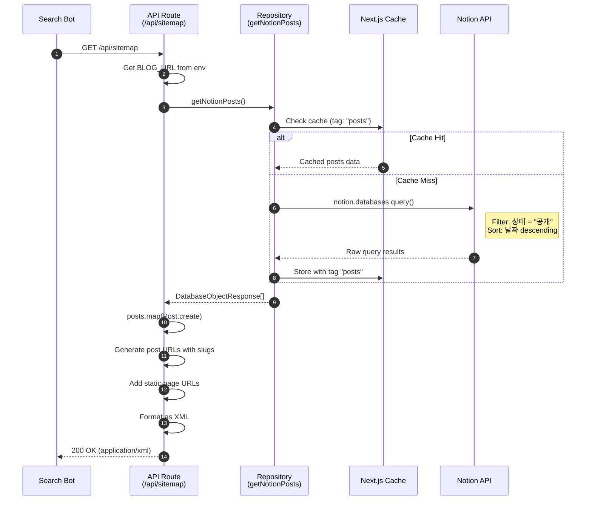
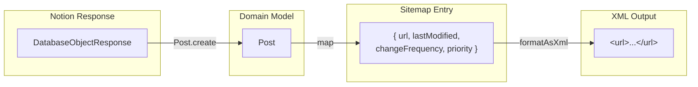
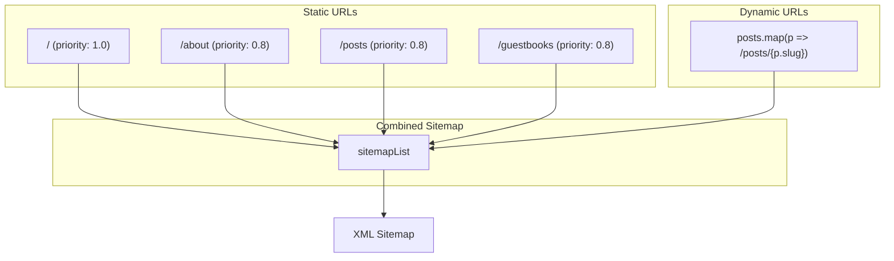
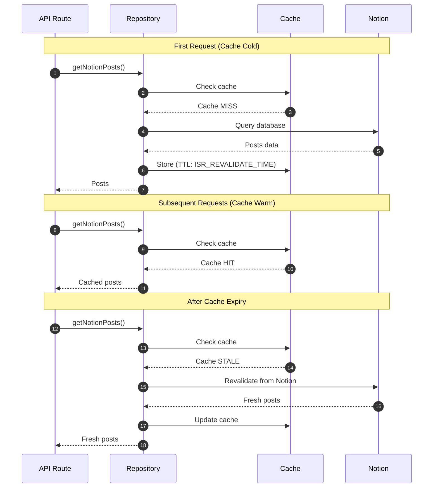
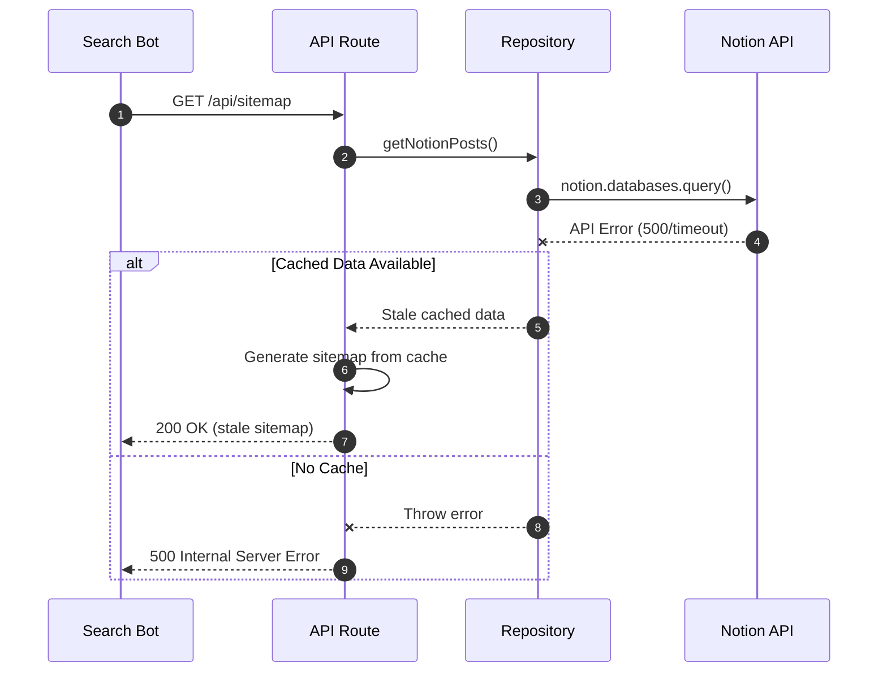
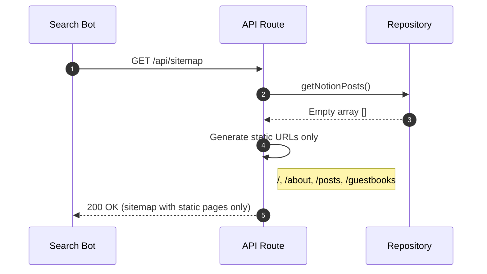

# Site Domain Sequence Diagrams

This document contains detailed sequence diagrams for all backend workflows in the Site domain.

## 1. Generate Sitemap

### Overview

Generate an XML sitemap containing all public blog URLs for search engine crawlers.

### Actors

- **Search Bot**: External crawler (Google, Bing, etc.)
- **API Route**: `/api/sitemap` handler
- **Repository**: `entities/notion/model`
- **Cache**: Next.js `unstable_cache`
- **Notion**: External Notion API

### Sequence

### Data Transformation

### URL Assembly

---

## 2. Cache Flow for Sitemap

### Overview

Sitemap generation leverages the same caching strategy as post listing.

### Sequence

### Cache Configuration

| Environment | ISR_REVALIDATE_TIME | Behavior |
|-------------|---------------------|----------|
| Development | 30 seconds | Fast iteration |
| Production | 300 seconds | Reduced API calls |

---

## 3. Error Scenarios

### Notion API Failure

### Empty Posts List

---

## 4. Performance Considerations

### Request Flow Timing

```mermaid
gantt
    title Sitemap Generation Timeline
    dateFormat X
    axisFormat %L ms

    section Cache Hit
    Check cache           :0, 5
    Return cached posts   :5, 10
    Format XML            :10, 20
    Send response         :20, 25

    section Cache Miss
    Check cache           :0, 5
    Query Notion API      :5, 500
    Parse response        :500, 520
    Store in cache        :520, 530
    Format XML            :530, 550
    Send response         :550, 560
```

### Optimization Points

| Aspect | Optimization |
|--------|-------------|
| Caching | Posts are cached, reducing Notion API calls |
| Response Size | XML is generated on-demand, not stored |
| Parallel Fetching | Single database query for all posts |
| Content-Type | Correct `application/xml` header |
