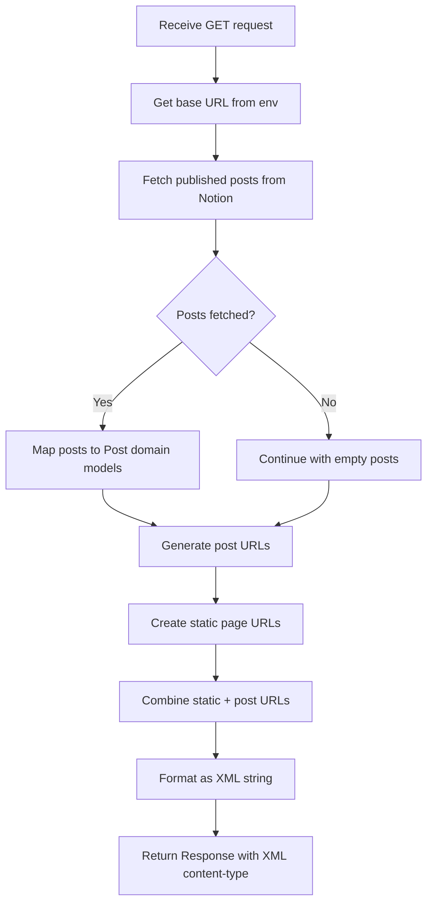

# Site Domain Use Cases (Backend)

This document describes the backend API use cases for the Site domain.

## UC-API-030: Generate Sitemap

### Endpoint Details

| Property | Value |
|----------|-------|
| Method | `GET` |
| Path | `/api/sitemap` |
| Auth | None (public) |
| Rate Limit | None |

### Purpose

Generate an XML sitemap containing all public blog URLs for search engine crawlers.

### Request

```typescript
// Method
GET

// URL
/api/sitemap

// Headers
Accept: application/xml
```

### Response

**Success (200)**:

```xml
<?xml version="1.0" encoding="UTF-8"?>
<urlset xmlns="http://www.sitemaps.org/schemas/sitemap/0.9">
  <url>
    <loc>https://example.com</loc>
    <lastmod>2024-12-08T00:00:00.000Z</lastmod>
    <changefreq>daily</changefreq>
    <priority>1</priority>
  </url>
  <url>
    <loc>https://example.com/posts/my-post</loc>
    <lastmod>2024-12-07T00:00:00.000Z</lastmod>
    <changefreq>daily</changefreq>
    <priority>0.8</priority>
  </url>
  <!-- ... more URLs -->
</urlset>
```

**Error (500)**:

```typescript
// Internal server error (e.g., Notion API failure)
// Returns empty or partial sitemap
```

### Implementation Flow



### Code Implementation

```typescript
// src/app/api/sitemap/route.ts

import type { MetadataRoute } from "next";
import { getNotionPosts } from "@/entities/notion/model";
import { Post } from "@/entities/posts/model";

export async function GET() {
  const baseUrl = process.env.BLOG_URL || "";

  // 1. Fetch and transform posts
  const posts = (await getNotionPosts()).map(Post.create);

  // 2. Generate post URLs
  const postUrls: MetadataRoute.Sitemap = posts.map(
    ({ slugifiedTitle, lastEditedTime }) => ({
      url: `${baseUrl}/posts/${slugifiedTitle}`,
      lastModified: new Date(lastEditedTime),
      changeFrequency: "daily",
      priority: 0.8,
    }),
  );

  // 3. Define static URLs
  const staticUrls = [
    { url: baseUrl, priority: 1, changeFrequency: "daily" },
    { url: `${baseUrl}/about`, priority: 0.8, changeFrequency: "daily" },
    { url: `${baseUrl}/posts`, priority: 0.8, changeFrequency: "daily" },
    { url: `${baseUrl}/guestbooks`, priority: 0.8, changeFrequency: "always" },
  ];

  // 4. Combine and format as XML
  const sitemapList = [...staticUrls, ...postUrls];
  const sitemap = formatAsXml(sitemapList);

  // 5. Return with correct content type
  return new Response(sitemap, {
    headers: { "Content-Type": "application/xml" },
  });
}
```

### URL Structure

| Page Type | URL Pattern | Priority | Change Frequency |
|-----------|-------------|----------|------------------|
| Home | `/` | 1.0 | daily |
| About | `/about` | 0.8 | daily |
| Posts List | `/posts` | 0.8 | daily |
| Guestbook | `/guestbooks` | 0.8 | always |
| Post Detail | `/posts/{slug}` | 0.8 | daily |

### Dependencies

**Internal Modules**:

- `src/entities/notion/model/index.ts`
  - `getNotionPosts()` - Fetches published posts from Notion
- `src/entities/posts/model/post.ts`
  - `Post.create()` - Creates domain model with slugified title

**External Services**:

- Notion API (read-only)

**Environment Variables**:

- `BLOG_URL` - Base URL for sitemap entries

### Error Handling

| Error Condition | Behavior | Recovery |
|-----------------|----------|----------|
| Notion API failure | May return partial or empty sitemap | Bot will retry |
| Missing BLOG_URL | URLs will be relative (invalid) | Set env variable |
| Post transformation error | Skip invalid posts | Continue with valid posts |

### Cache Strategy

The sitemap relies on the underlying `getNotionPosts()` cache:

| Aspect | Configuration |
|--------|---------------|
| Cache Tag | `posts` |
| Revalidate (dev) | 30 seconds |
| Revalidate (prod) | 300 seconds |

---

## XML Format Specification

### Sitemap Protocol

The generated sitemap follows the [Sitemaps XML format](https://www.sitemaps.org/protocol.html):

```xml
<?xml version="1.0" encoding="UTF-8"?>
<urlset xmlns="http://www.sitemaps.org/schemas/sitemap/0.9">
  <url>
    <loc>URL</loc>
    <lastmod>ISO8601 date</lastmod>
    <changefreq>frequency</changefreq>
    <priority>0.0-1.0</priority>
  </url>
</urlset>
```

### Field Descriptions

| Field | Description | Format |
|-------|-------------|--------|
| `loc` | Full URL of the page | Absolute URL |
| `lastmod` | Last modification date | ISO 8601 (YYYY-MM-DDTHH:MM:SS.sssZ) |
| `changefreq` | Expected change frequency | always, hourly, daily, weekly, monthly, yearly, never |
| `priority` | Relative importance | 0.0 to 1.0 (default 0.5) |

---

## Security Considerations

### Public Access

- Sitemap is intentionally public for search engines
- No authentication required
- No sensitive information exposed

### Rate Limiting

- No explicit rate limiting
- Relies on Notion API rate limits for post fetching
- Cached responses reduce API load

---

## Testing

### Unit Test Scenarios

```typescript
describe("GET /api/sitemap", () => {
  it("should return valid XML with correct content-type", async () => {
    const response = await GET();
    expect(response.headers.get("Content-Type")).toBe("application/xml");
  });

  it("should include static pages in sitemap", async () => {
    const response = await GET();
    const xml = await response.text();

    expect(xml).toContain("<loc>https://example.com</loc>");
    expect(xml).toContain("<loc>https://example.com/about</loc>");
    expect(xml).toContain("<loc>https://example.com/posts</loc>");
    expect(xml).toContain("<loc>https://example.com/guestbooks</loc>");
  });

  it("should include published posts in sitemap", async () => {
    // Mock getNotionPosts to return test posts
    const response = await GET();
    const xml = await response.text();

    expect(xml).toContain("/posts/test-post-slug");
  });

  it("should handle empty posts list", async () => {
    // Mock getNotionPosts to return empty array
    const response = await GET();
    const xml = await response.text();

    // Should still have static pages
    expect(xml).toContain("<loc>");
  });
});
```

### Integration Test Scenarios

```typescript
describe("Sitemap Integration", () => {
  it("should generate valid sitemap parseable by XML parsers", async () => {
    const response = await fetch("/api/sitemap");
    const xml = await response.text();

    // Validate XML structure
    const parser = new DOMParser();
    const doc = parser.parseFromString(xml, "application/xml");
    expect(doc.querySelector("parsererror")).toBeNull();
  });
});
```
